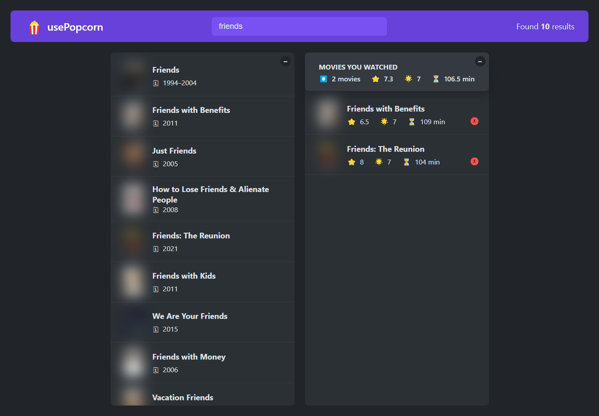

# 🍿 usePopcorn React App

This is a React application that allows users to search for movies using the OMDB API. The app displays search results, allows users to add movies to a watched list, and provides key details such as IMDb ratings and runtime.

🔗 **Live Demo:** [usePopcorn](https://usepopcorn-mo3bassias-projects.vercel.app)

---

## ✨ Features

- 🔍 **Search Movies**: Users can search for any movie by title, powered by the OMDB API.
- 🍿 **Add to Watched List**: Users can add movies to their "Watched" list for easy reference.
- ⭐ **IMDb Ratings**: Display movie details, including IMDb ratings and runtime.
- 🧮 **Average Ratings**: The app calculates and displays the average IMDb rating, user rating, and runtime of watched movies.
- 🔔 **Dynamic Title Update**: The app dynamically updates the page title based on the selected movie.
- ❌ **Watched List Management**: Users can easily remove movies from the "Watched" list.
- ⏳ **Loading Indicators**: Shows a loading indicator while fetching movies from the API.
- 🛑 **Error Handling**: Graceful error handling when no movies are found or when there’s a network issue.

---

## 🛠️ Technologies Applied

- ⚛️ **React**: Utilized React hooks (`useState`, `useEffect`) for managing state and side effects.
- 📡 **OMDB API**: Integrated with the OMDB API to fetch real-time movie data.
- 🎨 **CSS Modules**: Used for styling different components to ensure maintainable and scalable styles.
- 💫 **Custom Hooks**: Implemented custom hooks for various functionalities like handling selected movies and updating the title dynamically.
- 🌟 **StarRating Component**: Added a custom component for handling user ratings with stars.
- 🧮 **Utility Functions**: Created a reusable function to calculate the average of ratings and runtime.
- ⌨️ **Keyboard Event Listeners**: Managed keyboard events, such as `Escape` to close movie details, for enhanced user experience.
- 🔄 **Component Reusability**: Made components like `MovieList`, `WatchedList`, and `Box` reusable and modular.

---

## 📸 Preview

Here's a sneak peek of the app's interface:

---

Feel free to check out the live demo and explore the features! 😊
e layout.

- **I am really sorry for bluring images and posters of films, this is for private reasons**

- **Responsive Design**: Ensures the app looks great on any device.

Enjoy your movie experience with **usePopcorn**! 🍿✨
